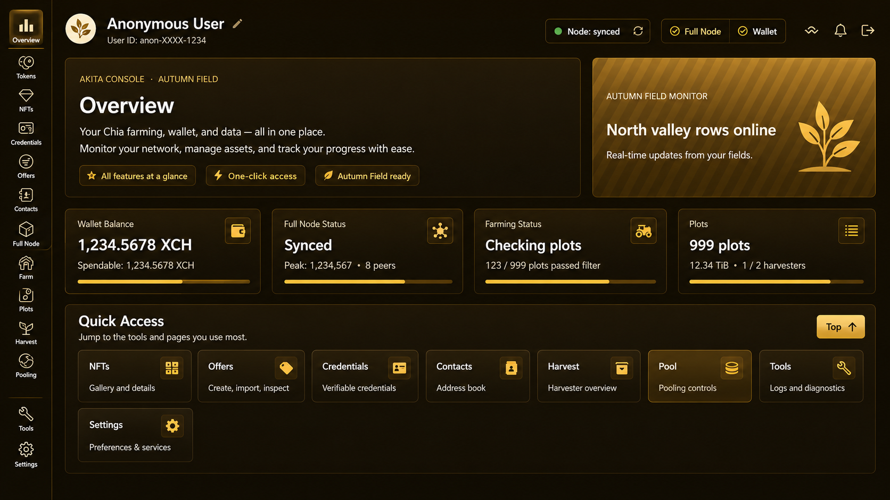

# Akita Autumn Field Console

Unofficial Chia GUI visual mod: Akita Console - Autumn Field theme for Chia 2.7.1.

This package replaces the Electron GUI bundle `app.asar`.
It keeps the original Chia GUI functions and changes the visual layout/theme.

## Preview

## Status

The new Overview screen is currently a visual front page only.
Its summary cards are not yet connected to live Chia node, wallet, farm, or plot data.

All original Chia GUI pages remain available from the sidebar.
The Overview screen is planned for functional updates in a future release.

## Target

- Chia Blockchain GUI: 2.7.1
- Windows local install
- Original project: https://github.com/Chia-Network/chia-blockchain

## Download

Download `app.asar` from the Releases page:

https://github.com/twinedge39-web/Akita-autumn_field_console/releases/tag/v0.1.0-chia-2.7.1

SHA256:

`A8E5D8F68045A151DAE0EC6484CE71FABE5841AF999857C3A236AFC43339187C`

## Install

1. Close Chia Blockchain.
2. Backup the original file:

   `C:\Users\<you>\AppData\Local\Programs\Chia\resources\app.asar`

3. Replace it with the modded `app.asar`.
4. Start Chia Blockchain.

## Restore

Restore the backed up `app.asar`, or reinstall/repair the official Chia app.

## Notice

This is an unofficial visual mod.
It is not affiliated with, maintained by, or endorsed by Chia Network.

Use at your own risk. This mod is intended for local GUI customization.

Based on Chia Network's chia-blockchain GUI, licensed under Apache License 2.0.
